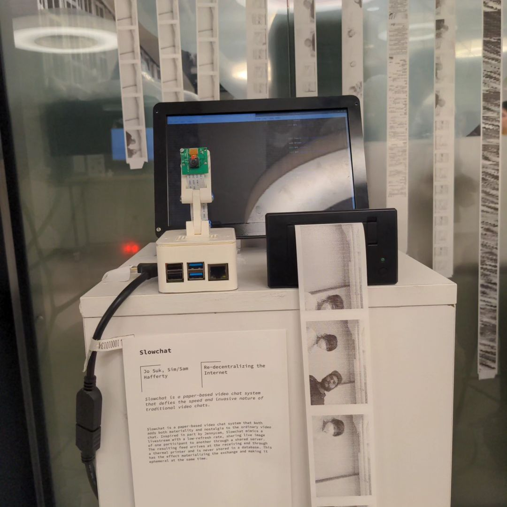
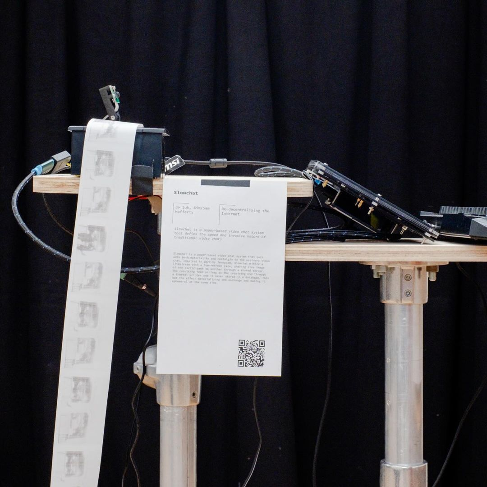

# How to join our slow, paper-based video chat network!
*Note: this is only currently applicable for folks with access to our school's development WiFi network, we hope to build an HTTPS version of this system next!*

Station 1                           |  Station 2
:----------------------------------:|:----------------------------------:
|  |  |

## Materials:
- Raspberry Pi w/ Raspberry Pi OS (full-version) 
- TTL Thermal Printer 
- Pi Camera Module (ribbon connection)

## Process:
1. If this is your first time working with a RPI, see the linked guide to set up your Pi with Raspberry Pi OS.
2. With the RPI powered off, attach the Pi cam module via the ribbon connector labeled camera (not display).
3. Test your cam - pull this git repo and run the script titled **autocameracapture.py** for a minute or so. If you see images starting to populate in a sub-directory called "captures" then you are set! If not you may need to debug your camera - check raspi-config to ensure necessary permissions are given. Note: the picamera python module should be installed (sorry! requirements.txt coming soon!)
4. Next, with both the RPI and printer unpowered - attach the thermal printer. The ground, RX & TX pins pictured below are where you want to connect the two. Black to ground, Yellow to TX, Green to RX.
    
5. Time to power it all on so you can configure & test your printer! If your printer came with a test printout in the box, look at it closely for voltage and baud rate. Either way follow steps in the [Adafruit tutorial linked here](https://learn.adafruit.com/networked-thermal-printer-using-cups-and-raspberry-pi/connect-and-configure-printer) to enable printing via lp & over the network on your printer. Be sure to only follow steps relevant for TTL printers - USB steps do not apply.
  - Note: if your printer is still printing gibberish try making sure the voltage is correct & rebooting.
6. Now that your pi cam and thermal printer are all set up, time to run the code! Navigate to the **tcpTest** directory. Run **reciever.py** to see our images & **sender.py** to send your own (or better yet - both at the same time to do both!).

That's the gist! Reach out with any Qs.
